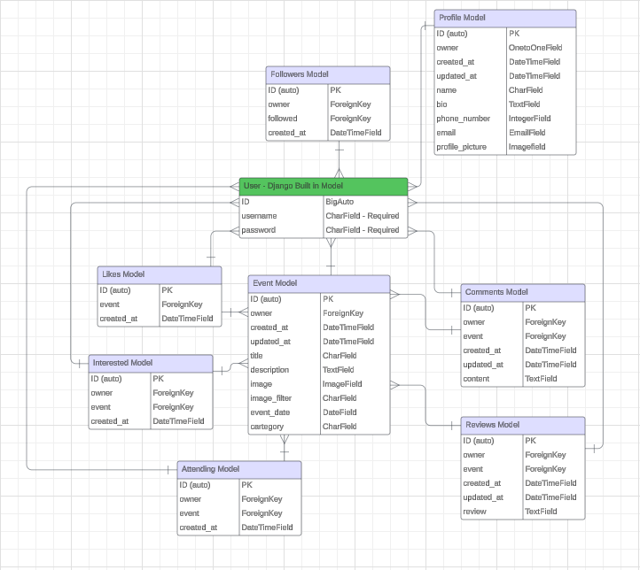
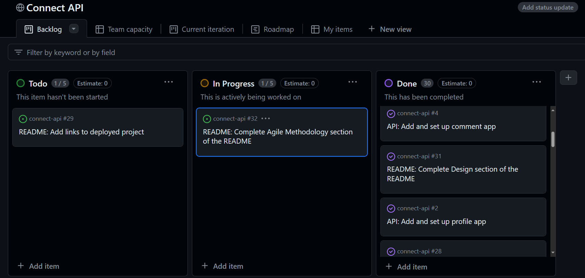
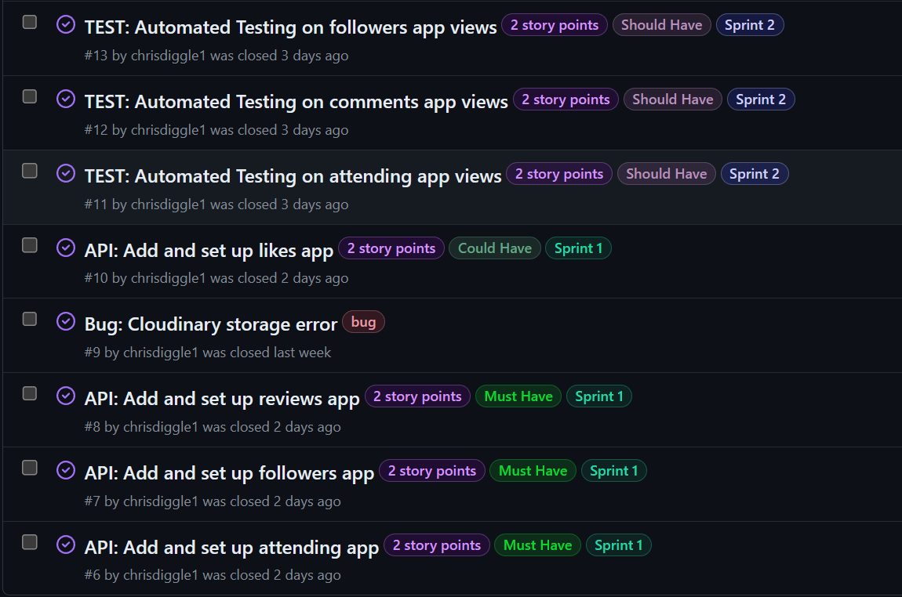

# **Connect API**

## Table of Contents

- [Objective](objective)
- [Links to deployed Project](#links-to-deployed-project)
- [Features](#features)
    * [Models](#models)
- [Design](#design)
    * [Aim](#aim)
    * [Scope](scope)
    * [Structure](structure)
- [Agile Methodology](#agile-methodology)
- [Languages](#languages)
- [Frameworks and Libraries](#frameworks-and-libraries)
- [Tools and Technologies](#tools-and-technologies)
- [Testing and Validation](#testing-and-validation)
- [Bugs and Fixes](#bugs-and-fixes)
- [Deployment](#deployment)
- [Cloning this repository](#cloning-this-repository)
- [Forking a branch](#forking-a-branch)
- [Credits](#credits)
- [Acknowledgements](#acknowledgements)

## Objective

The objective of the Connect API is to provide a backend database to create event information in my area. The database allows the functionality to create, view, edit and delete event information in the local area. A user who is going to be hosting an event can upload the event detials, which will include an image for the event, a description of the event including the date and time and an event category. Users can  follow the event hosts and they will be able to select if they are interested in the event or if they are going to attend the event. A user can comment on an event and leave a review once the event has past.

## Links to deployed Project

[Connect API Live link](https://connect-api-5644c52001aa.herokuapp.com/)

[Connect App frontend Live Link]()

## Features

### **Models**

### Profile

* owner - OnetoOneField
* created_at - DateTimeField
* updated_at - DateTimeField
* name - CharField
* bio - TextField
* phone_number - IntegerField(optional)
* email - EmailField(optional)
* profile_picture - ImageField

### Events

* owner = ForeignKey
* created_at - DateTimeField
* updated_at - DateTimeField
* title - CharField
* description - TextField
* image - ImageField
* image_filter - CharField
* event_date - DateField
* category - CharField

### Attending

* owner - ForeignKey
* event - ForeignKey
* created_at - DateTimeField

### Comments

* owner - ForeignKey
* event - ForeignKey
* created_at - DateTimeField
* updated_at - DateTimeField
* content - TextField

### Followers

* owner - ForeignKey
* followed - ForeignKey
* created_at - DateTimeField

### Interested

* owner - ForeignKey
* event - ForeignKey
* created_at - DateTimeField

### Likes

* owner - ForeignKey
* event - ForeignKey
* created_at - DateTimeField

### Reviews

* owner - ForeignKey
* event - ForeignKey
* created_at - DateTimeField
* updated_at - DateTimeField
* review - TextField

## Design

### Aim

The aim is to store data on an event hosting site which includes posting events for users to be able to state whether they are interested, attending, like and leave reviews for an event that has been posted, and provide a full range of CRUD functionality. 

### Structure

The entity relationship diagram below shows the relationships between the models used for this project.

## Agile Methodology

The Kanban project board in GitHub was used to build this API using Agile principles. Moscow prioritisations was used, along with seperating the work into sprints and story points set to each task indicating the complexity for that task.

* Sprint 1 - Setting up each app in full used in the project.
* Sprint 2 - Automated testing and code validation.
* Sprint 3 - Complete README.mdand TESTING.md

## Languages

* Python

## Frameworks and Libraries

[Django 3.2](https://www.djangoproject.com/) high-level Python web framework used to develop this application.

[Django Rest Framework 3.14](https://www.django-rest-framework.org/) - A powerful a flexible toolkit for building Web APIs.

[Cloudinary 1.4 and Cloudinary storage 0.3](https://cloudinary.com/) - Allowing connection with Cloudinary.

[Pillow 8.2](https://pypi.org/project/pillow/8.2.0/) - A Python imaging library that includes image processing capabilities.

[dj_database_url 2.1](https://pypi.org/project/dj-database-url/) - A Django utility used to configure the API to connect to an outside database using its URL.

[psycopg2](https://pypi.org/project/psycopg2/) - A PostgreSQL database adapter for the Python programming language.

[gunicorn 22.0](https://gunicorn.org/) - A Python WSGI HTTP Server for UNIX.

[django-cors-headers 4.3.1](https://pypi.org/project/django-cors-headers/) - A Django application for handling the server headers required for Cross-Origin Resource Sharing (CORS)

[django-allauth 0.44.0](https://pypi.org/project/django-allauth/) - Integrated set of Django applications addressing authentication, registration, account management as well as 3rd party (social) account authentication.

[dj-rest-auth package 2.1.9](https://dj-rest-auth.readthedocs.io/en/latest/installation.html) - A set of REST API endpoints to handle User Registration and Authentication tasks.

[djangorestframework-simplejwt package 4.7.2](https://pypi.org/project/djangorestframework-simplejwt/) - A JSON Web Token authentication plugin for the Django REST Framework.

[django-filter 23.5](https://pypi.org/project/django-filter/) - Django-filter is a reusable Django application allowing users to declaratively add dynamic QuerySet filtering from URL parameters.

## Tools and Technologies

## Testing and Validation

See [TESTING.md](TESTING.md) for all testing and validation.

## Bugs and Fixes

| Bug | Fix|
| --- | ---|
| After creating the profiles model, I tried to access the 'Profiles' section in the admin panel, but I was receiving an error: CLOUDINARY_STORAGE dictionary with CLOUD_NAME, API_SECRET and API_KEY in the settings or set CLOUDINARY_URL variable (or CLOUDINARY_CLOUD_NAME, CLOUDINARY_API_KEY, CLOUDINARY_API_SECRET variables). I checked mulitple times the cloudinary variable were setup correctly in env.py and settings.py. | I had stored the env.py file in the 'connect_api directory. Once I moved the file to the project root then I could access the profile section in the admin panel as expected. |

## Connecting to the API

## Deployment

## Cloning this repository

## Forking a branch

## Credits

## Acknowledgements
