## Testing and Validation

### Contents

[Code Validation](#code-validation)

[Manual Testing](#manual-testing)

[Automated Testing](#automated-testing)

## Code Validation

## Manual Testing

## Automated Testing

### AttendingList View Tests

| Test name | Result |
| --- | --- |
| test_can_list_attending | Pass |
| test_logged_in_user_can_confirm_attending | Pass |
| test_logged_out_user_cannot_confirm_attending | Pass |

AttendingList view test

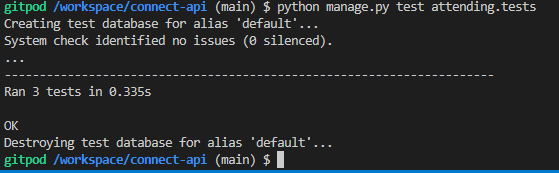

 

### AttendingDetail View Tests

| Test name | Result |
| --- | --- |
| test_can_retrieve_attending | Pass |
| test_user_can_delete_own_attending | Pass |
| test_user_cannot_delete_other_users_attending | Pass |

AttendingDetail view test

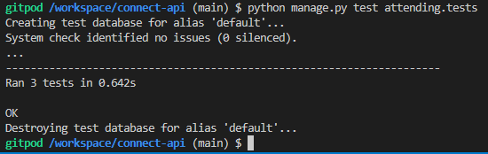

 

### CommentList View Tests

| Test name | Result |
| --- | --- |
| test_can_list_comments | Pass |
| test_logged_in_user_can_create_comment | Pass |
| test_logged_out_user_cannot_create_comment | Pass |

CommentList view test

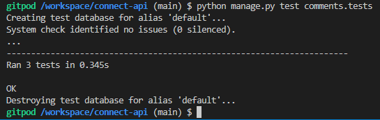

 

### CommenDetail View Tests

| Test name | Result |
| --- | --- |
| test_can_retrieve_comment | Pass |
| test_user_can_update_own_comment | Pass |
| test_user_cannot_update_other_users_comment | Pass |
| test_user_can_delete_own_comment | Pass |
| test_user_cannot_delete_other_users_comment | Pass |

CommentDetail view test

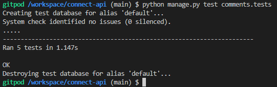

 

### EventList View Tests

| Test name | Result |
| --- | --- |
| test_can_list_events | Pass |
| test_logged_in_user_can_create_event | Pass |
| test_logged_out_user_cannot_create_event | Pass |

EventList view test

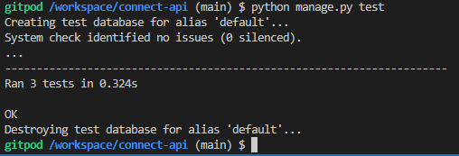

 

### EventDetail View tests

| Test name | Result |
| --- | --- |
| test_can_retrieve_event_using_valid_id | Pass |
| test_cannot_retrieve_event_using_invalid_id | Pass |
| test_user_can_update_own_event | Pass |
| test_user_cannot_update_someone_elses_event | Pass |

EventList view test

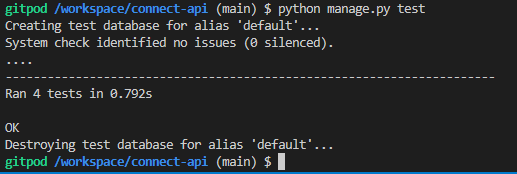

 

### FollowerList View tests

| Test name | Result |
| --- | --- |
| test_can_list_followers | Pass |
| test_logged_in_user_can_create_follow | Pass |
| test_logged_out_user_cannot_create_follow | Pass |

FollowerList view test

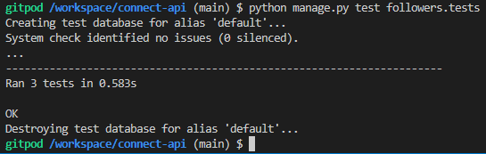

 

### FollowerDetail View tests

| Test name | Result |
| --- | --- |
| test_can_retrieve_follow | Pass |
| test_user_can_delete_own_follow | Pass |
| test_user_cannot_delete_other_users_follow | Pass |

FollowerDetail view test

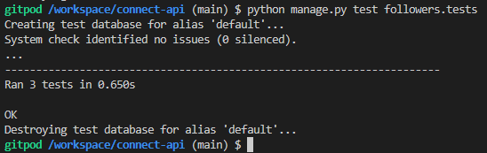

 

### InterestedList View tests

| Test name | Result |
| --- | --- |
| test_can_list_interested | Pass |
| test_logged_in_user_can_confirm_interested | Pass |
| test_logged_out_user_cannot_confirm_interested | Pass |

InterestedList view test

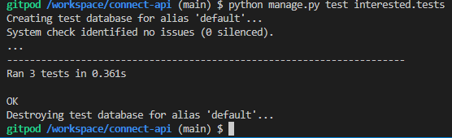

 

### InterestedDetail View tests

| Test name | Result |
| --- | --- |
| test_can_retrieve_interested | Pass |
| test_user_can_remove_own_interested | Pass |
| test_user_cannot_remove_other_users_interested | Pass |

InterestedDetail view test

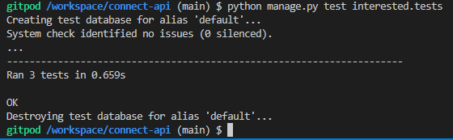

 

### LikesList View tests

| Test name | Result |
| --- | --- |
| test_can_list_likes | Pass |
| test_logged_in_user_can_add_like | Pass |
| test_logged_out_user_cannot_add_like | Pass |

LikesList view test

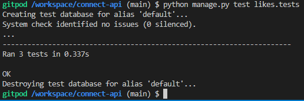

 

### LikesDetail View tests

| Test name | Result |
| --- | --- |
| test_can_retrieve_like | Pass |
| test_user_can_remove_own_like | Pass |
| test_user_cannot_remove_other_users_like | Pass |

LikesDetail view test

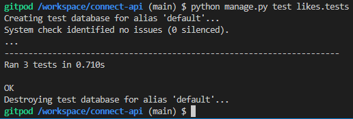

 

### ProfilesList View tests

| Test name | Result |
| --- | --- |
| test_can_list_profiles | Pass |
| test_profiles_include_events_count | Pass |
| test_profiles_include_followers_count | Pass |
| test_profiles_include_following_count | Pass |

ProfilesList view test

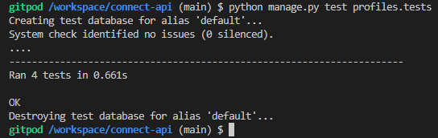

 

### ProfilesDetail View tests

| Test name | Result |
| --- | --- |
| test_can_retrieve_profile | Pass |
| test_user_can_update_own_profile | Pass |
| test_user_cannot_update_other_users_profile | Pass |

ProfilesDetail view test

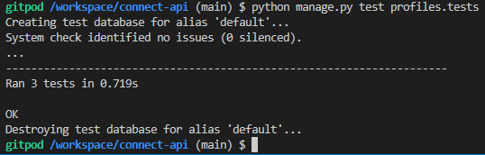

 

### ReviewsList View tests

| Test name | Result |
| --- | --- |
| test_can_list_reviews | Pass |
| test_logged_in_user_can_create_review | Pass |
| test_logged_out_user_cannot_create_review | Pass |

ReviewsList view test

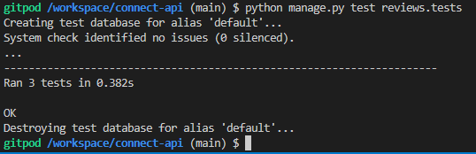

 

### ReviewsDetail View tests

| Test name | Result |
| --- | --- |
| test_can_retrieve_review | Pass |
| test_user_can_update_own_review | Pass |
| test_user_cannot_update_other_users_review | Pass |
| test_user_can_delete_own_review | Pass |
| test_user_cannot_delete_other_users_review | Pass |

ReviewsDetail view test

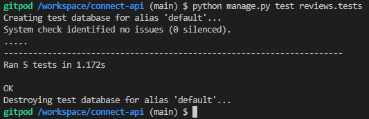

 